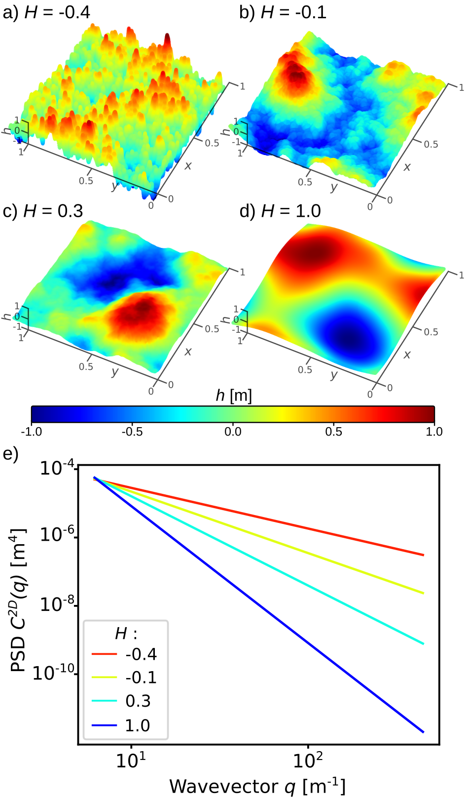

Rough surface generation
========================

The characterization of a rough surface can be done with respect to its spatial frequency content.
This can be transformed into a constructive method by using a sum of trigonometric functions similar to a Fourier series.
Each term in such a sum represents a certain frequency of spatial oscillation.

Self-affine scaling
-------------------

A broad-spectrum of natural surfaces shows an intrinsically multi-scale roughness.
This scaling phenomenon is known as self-affine that differs from the self-similar fractal geometry by the anisotropric character of the scaling transformation.
The self-affine scaling transformation for a height distribution :math:`h(x,y)` can be resumed by,

.. math::

	\lambda^{H}h(\frac{x}{\lambda}, \frac{y}{\lambda}) = h(x,y)

where :math:`H` is the Hurst exponent and :math:`\lambda` is a scalar.

Power spectrum density
----------------------

The characterization of surface roughness relies on the description of representative spatial frequencies.
The 2D power spectral density (PSD) :math:`C^{2D}(\mathbf{q})` is used to analyze a surface across a range of wave vectors :math:`\mathbf{q} = (q_x , q_y )` and describes the contribution of the various spatial frequencies.
It is expressed as the fast Fourier transform of the autocorrelation function :math:`\langle h(\mathbf{x})h(\mathbf{0})\rangle` (with :math:`\mathbf{x} = (x,y)`),

.. math::

	C^{2D}(\mathbf{q}) = \frac{1}{(2\pi)^2} \int \langle h(\mathbf{x})h(\mathbf{0}) \rangle e^{-i\mathbf{q}.\mathbf{x}} d\mathbf{x}

In the case of self-affine scaling, the PSD has a power-law dependence on the spatial frequency such as,

.. math::

	C^{2D}(\textbf{q}) \propto \textbf{q}^{-2-2H}

where :math:`H` is related to the surface fractal dimension :math:`D_f` by the relation :math:`D_f = 3 − H`.

Construction method
-------------------

In *Pyrough*, rough surfaces are modeled in the real space using a sum of trigonometric functions where each term of the sum represents the contribution of a spatial frequency.
In cartesian coordinates, the mathematical expression of spatial oscillations is given by,

.. math::

	cos(\mathbf{q}.\mathbf{x} + \phi) = cos[2\pi(\nu_x x + \nu_y y) + \phi]

where :math:`\nu_x` and :math:`\nu_y` are the the spatial frequencies along :math:`\vec{u_x}` and :math:`\vec{u_y}` directions respectively and :math:`\phi` is the phase.

A discrete set of spatial frequencies :math:`\nu_x = a` and :math:`\nu_y =  b` (where :math:`a` and :math:`b` are integers) is used to rationalize the range of investigated frequencies.
:math:`A` and :math:`B` are defined as the respective high-frequency cutoffs for :math:`a` and :math:`b` so that :math:`a \in [-A;A]` and :math:`b \in [-B;B]`.
Thus, the shortest wavelengths are :math:`\lambda_{x,min} = \frac{1}{A}` and :math:`\lambda_{y,min} = \frac{1}{B}` along :math:`\vec{u_x}` and :math:`\vec{u_y}` directions, respectively.
:math:`a` and :math:`b` can be positive or negative to ensure oscillations in both directions.
A rough surface :math:`h(x,y)` can be described by a sum of elementary waves as,

.. math::

	h(x,y) = \sum_{a=-A}^{A}  \sum_{b=-B}^{B} \alpha_{a,b}cos[2\pi(a x + b y) + \phi]

where :math:`\alpha_{a,b}` is the associated amplitude to each elementary wave.

Two more contributions are made in order to allow *Pyrough* to generate self-affine rough surfaces that are randomly perturbed.
First, the phase is randomly perturbed using :math:`\phi = U(a,b)` where :math:`U` states for a uniform distribution on an interval of length :math:`\pi`.
Also, random perturbations and self-affine aspects are implemented within :math:`\alpha_{a,b}`.
One can for example choose :math:`\alpha_{a,b}` as a zero-centered Gaussian distribution to get a smooth but random variation in amplitudes without constraining the magnitude i.e., :math:`\alpha_{a,b} = G(a,b){(a^2+b^2)}^{-(1+H)}` where :math:`G` states for a reduced centered normal law and :math:`{(a^2+b^2)}^{-(1+H)}` traduces the self-affine aspect of the surface.
Finally, the construction of a randomly perturbed self-affine surface can be modeled as,

.. math::

	h(x,y) = C_1\sum_{a=-A}^{A} \sum_{b=-B}^{B} G(a,b) (a^2+b^2)^{-(1+H)} cos[2\pi(a x + b y) + U(a,b) ]

in which H allows to monitor the roughness degree and :math:`C_1` is a normalization factor introduced to fit the surface heights to the sample dimensions.

    Random numerical self-affine rough surfaces for various Hurst exponents. a) H=-0.4, b) H=-0.1, c) H=0.3, d) H=1.0, e) PSD of the various *h* profiles. For all calculations, A=50, B=50 and h(x,y) values are normalized between 1 and -1.
