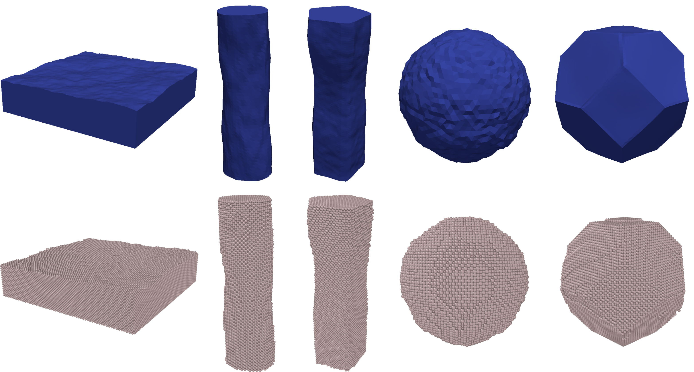

.. Pyrough documentation master file, created by
   sphinx-quickstart on Thu May 12 08:43:00 2022.
   You can adapt this file completely to your liking, but it should at least
   contain the root `toctree` directive.

Pyrough - a tool to build 3D samples with rough surfaces for atomistic and finite-element simulations 
===================================================

**Pyrough** is a Python code generating 3D objects with the ability to manage surface height distribution of isotropic and Gaussian random surfaces by using classical roughness theory.
**Pyrough** constructs both classical mesh samples (.msh, .stl, etc.) compatible with most FEM programs as well as atomistic structures (.lmp, .xyz, .cfg, etc.) for further molecular dynamics studies. 

    Rough shapes created by **Pyrough** (mesh and atomic figures). From left to right : film, cylindrical wire, faceted wire, sphere and wulff-shaped faceted particle.

A parameter file including the main aspects of the targeted 3D sample (material, shape, dimensions, orientations, crystal structure, etc.) enables the generation of a rough object by using the coupled Gmsh library. 
Several 3D shapes are currently available in **Pyrough** including classical particle shapes (cubes, spheres, Wulff shapes), cylindrical or faceted wires as well as plates or thin films. 
Additional ones might easily be implemented by the user thanks to **Pyrough**’s modular construction.

.. toctree::
   :maxdepth: 4
   :caption: Contents

   ./installation.rst
   ./equations.rst
   ./functions.rst
   ./shapes.rst
   ./biblio.rst
   ./credits.rst

Indices and tables
~~~~~~~~~~~~~~~~~~~~~~~~~~~~~~~~~~~

* :ref:`genindex`
* :ref:`modindex`
* :ref:`search`
